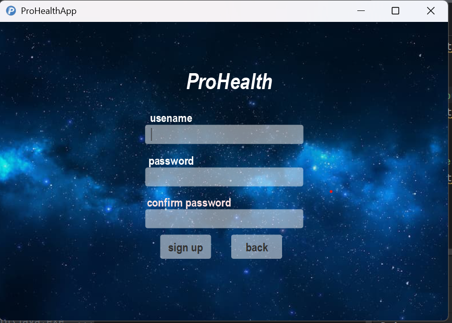
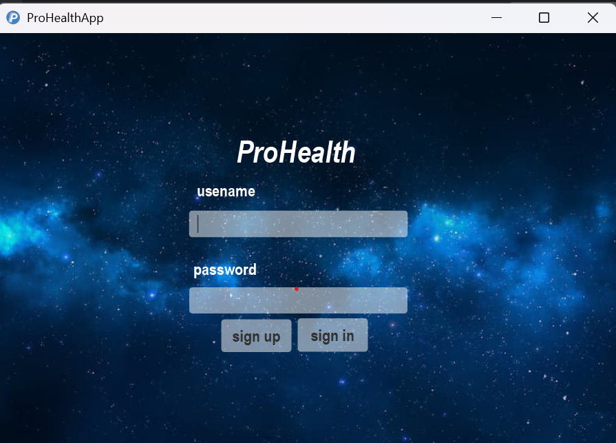
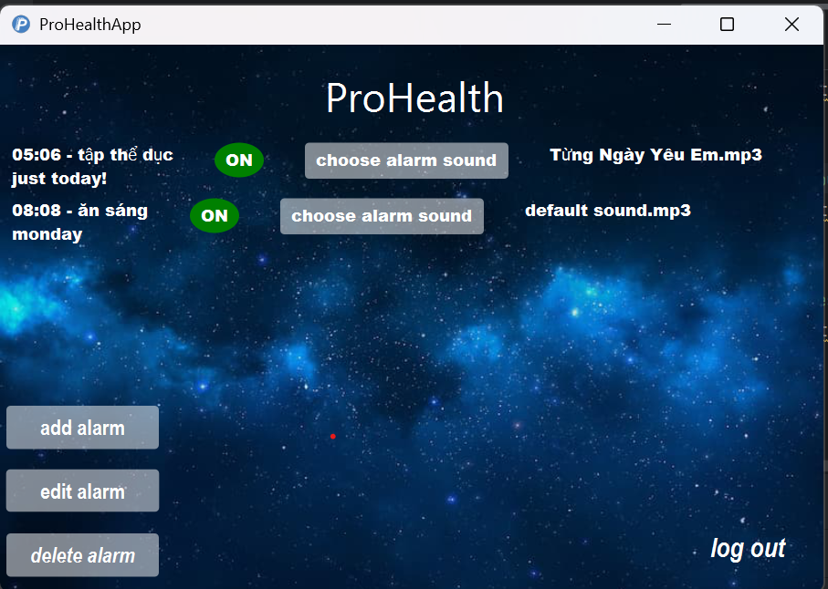
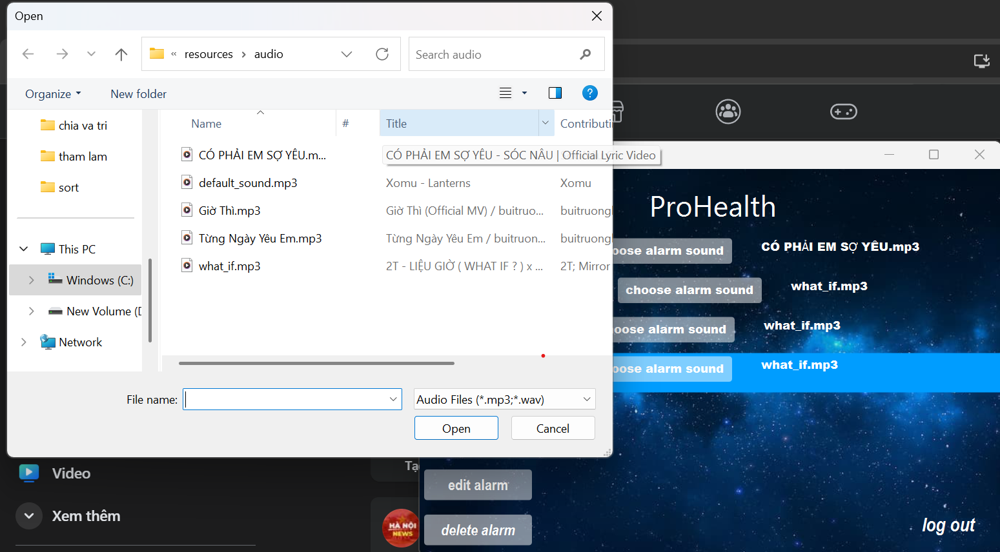
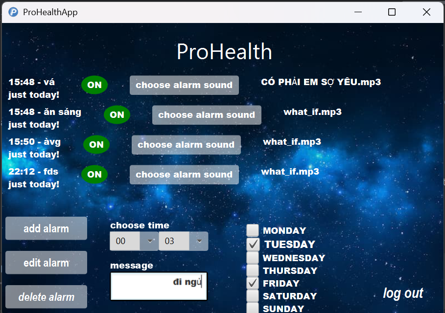

# [ProHealth]

[Mô tả dự án]

ProHealth is an application that help users to create themselves alarm. This app allow them to add, edit and delete alarm morever it can reminder users to take certain actions to improve their health.

## Authors

- [@HoangBien](https://github.com/bien3008)

## Demo

[Link Video Demo](https://youtu.be/IFNJAlpNapQ)

## Screenshots

**- sign up scene**



**- login scene**



**- main scene**



**- choose music**



**- alarm**



## Features

- add alarm.
- edit alarm.
- delete alarm.
- remind user to stand up and move around, keep fit and get the blood flowing each 30 minutes.
- remind user to look into the green space to rest your eyes each 10 minutes.
- remind user to drink a cup of water to help your body not to get dehydrated each 1 hour.
- set alarm by day of the week.
- allow user to choose alarm sound.

## Requirements

- Java 17+
- Maven 3.8+

## Installation

Cách cài đặt dự án

```bash
  - Clone dự án
  - Mở terminal và chạy lệnh: mvn clean install
  - Chạy ứng dụng

  - Down file jar từ ...
  - Chạy file jar
```

## License

[MIT](https://choosealicense.com/licenses/mit/)
